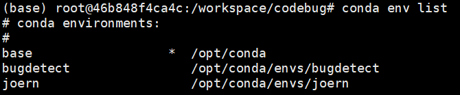

# MARCOVul---Real-World Code Vulnerability Detection Framework: From Data Preprocessing to Multi-Feature Fusion Detection
## Dataset

**Environment configuration file (docker image, requirements.txt, and freeze-conda-env.yml):**

Zhang, J. (2025). Docker Image file of MARCOVul. Zenodo. https://doi.org/10.5281/zenodo.14875099

**Data files:**

Zhang, J. (2025). All data of MARCOVul [Data set]. Zenodo. https://doi.org/10.5281/zenodo.14878568

Data files include two zip files: ``dataset.zip`` and ``AllData.zip``.  Where ``AllData.zip`` includes everything in ``dataset.zip``. 

Zhang, J. (2025). The optimized data of MARCOVul [Data set]. Zenodo. https://doi.org/10.5281/zenodo.17529638

This dataset is a higher-quality version regenerated in our follow-up research after refining the generation rules of DiverseVul-Derived, primarily by improving the criteria for identifying identical functions.

##### dataset.zip

``dataset.zip`` includes only raw data and derived data, excluding intermediate data and model data.

##### AllData.zip

The AllData folder structure is the same as the code folder structure.

The **dataset** folder contains:

- **DiverseVul**: The original dataset. Among them, `diversevul_20230702.json` is the obtained raw data, while `train.jsonl`, `valid.jsonl`, and `test.jsonl` are the randomly split training, validation, and testing sets.
- **DiverseVul-Derived**: The dataset after data derivation. Among them, `allData.jsonl` contains all the data with verified functions before data derivation, while `train.jsonl`, `valid.jsonl`, and `test.jsonl` are the training, validation, and testing sets after data derivation.

The **joern/data** folder contains all generated intermediate structure data:

- **DiverseVul-Derived**: Data after intermediate structure generation.
- **DiverseVul-Derived-enhance**: Data after data augmentation.
- **DiverseVul-Derived-simplify**: Data after data simplification.
- **DiverseVul-Derived-simplify-enhance**: Data after both data simplification and data augmentation.

The **MultiFCode/LanguageModel** folder contains:

- **pre-model**: The raw language models.

- **saved_models**: The language models fine-tuned on the training set.

  

## Code of MARCOVul

### File structure

The file structure is as follows:

```
codebugmodel/

│

├── configs/

│	├── config.yaml

│	└── parse_args.py

├── dataset/

│	├── DiverseVul-Derived

├── joern/

│	├── data/

│	│	├── cpPickle.py

│	│	├──dataEnhance.py

│	│	├──simplifyMiddleStructureCode.py

│	│	├──statisticsCweProjectVul.py

│	│	└── validDataUsable.py

│	├── joern_parse.py

│	├── sensiAPI.txt

│	└── symbolizer.py

├── MultiFCode/

│	├── data/

│	│	├── processed/

│	│	│	└── pre_embed/

│	│	└── word2vec/

│	├── embedding/

│	│	├── embedding.py

│	│	└── vocabulary.py

│	├── LanguageModel/

│	│	├── cache/

│	│	├── dataset/

│	│	├── oldDataset/

│	│	├── pre-model/

│	│	├── saved_models/

│	│	├── base_test.sh

│	│	├── evaluation_test_set.sh

│	│	├── model.py

│	│	├── run.py

│	│	├── sensiAPI.txt

│	│	└── symbolizer.py

│	├── model/

│	├── wandb/

│	├── dataSet.py

│	├── model.py

│	├── sensiAPI.txt

│	├── tokenize_code.py

│	└── train.py

├── util/

│	└──utils.py

└── Main.sh

```


### config

The **config** folder contains the corresponding training configuration files.

### dataset

The **dataset** folder contains the raw data without the generation of intermediate structures.

### joern

The **joern** folder is for generating intermediate structures. After running the `joern_parse` command with appropriate parameters, the corresponding intermediate structure code will be generated in the **data** folder.

The **data** folder contains:

- **simplifyMiddleStructureCode.py**: Code for simplifying intermediate structures.
- **dataEnhance.py**: Code for data augmentation.
- **cpPickle.py**, **statisticsCweProjectVul.py**, **validDataUsable.py**: Utility code for various purposes.

### MultiFCode

The **MultiFCode** folder is for multi-feature fusion code. Running `train.py` will allow for training, validation, and testing.

- **model.py**: Model architecture code.
- **dataSet.py**: Data loading code.

The **data** folder contains:

- **processed**: Preprocessed data that hasn't been embedded.
- **processed/pre_embed**: Preprocessed and pre-embedded data.
- **word2vec**: Pre-trained word2vec models (used for pre-research, not used in this study).

The **embedding** folder contains:

- Pre-trained **word2vec+RNN** models (not used in this study).

The **LanguageModel** folder contains:

- **cache**: Cache folder.
- **dataset**: Training, validation, and testing data files for the Derived dataset.
- **oldDataset**: Training, validation, and testing data files for the original dataset.
- **pre-model**: Raw language models pulled from Hugging Face after.
- **saved_models**: Models fine-tuned on the training set.
- **base_test.sh**: Training, validation, and testing script.
- **evaluation_test_set.sh**: Test-only script.
- **model.py**: Model code.
- **run.py**: Code for training, validation, and testing.

The **model** folder contains the model outputs from running `train.py`.

The **wandb** folder stores corresponding logging files.

### util

The **util** folder contains the **utils.py** file, which includes utility code used throughout the framework.

### Main.sh

The **Main.sh** script is the master run script. After configuring the environment, preparing the raw data, and setting up pre-trained models, running **Main.sh** will execute the entire pipeline. If you only need to run specific parts, the script should be adjusted accordingly.

### Docker

The conda environment in docker is shown in the following image:



- **joern** environment: Used for generating intermediate code structures with joern. (need use docker image)
- **bugdetect** environment: Used for multi-feature fusion vulnerability detection.

We provide the corresponding Docker image stored in `xxxxxx` as `zjx-cvd-v1.tar`.

To load the Docker image, use the command:

``docker load < zjx-cvd-v1.tar ``

To run the container, use the following command:

``docker run -itd --name name(e.g. codebug) --shm-size 120g -p Port mapping (e.g. 48422:422) --runtime=nvidia -v Path mapping (e.g. /xxx/codebug:/workspace/codebug) zjx/cvd:v1 /bin/bash``

To enter the container, use the following command:

``docker exec -it name (e.g. codebug) /bin/bash``


## Citation

If this project or dataset has been helpful for your research, please consider citing our paper.

### How to Cite

You can cite our work using the following BibTeX entry:

```BibTeX
@article{zhang2025real,
  title={Real-World Code Vulnerability Detection Framework: From Data Preprocessing to Multi-Feature Fusion Detection},
  author={Zhang, Jixian and Du, Qingfeng and Li, Sheng and Lu, Zhongda and He, Ting and Liu, Chengwei},
  journal={IEEE Transactions on Dependable and Secure Computing},
  year={2025},
  publisher={IEEE}
}
```


## License 

This project is licensed under the **MIT License** - see the [LICENSE](LICENSE) file for details. 

In short, the MIT license allows you to do almost anything you want with the code, as long as you include the original copyright and license notice in any copy of the software/source. It is very permissive and business-friendly. 

